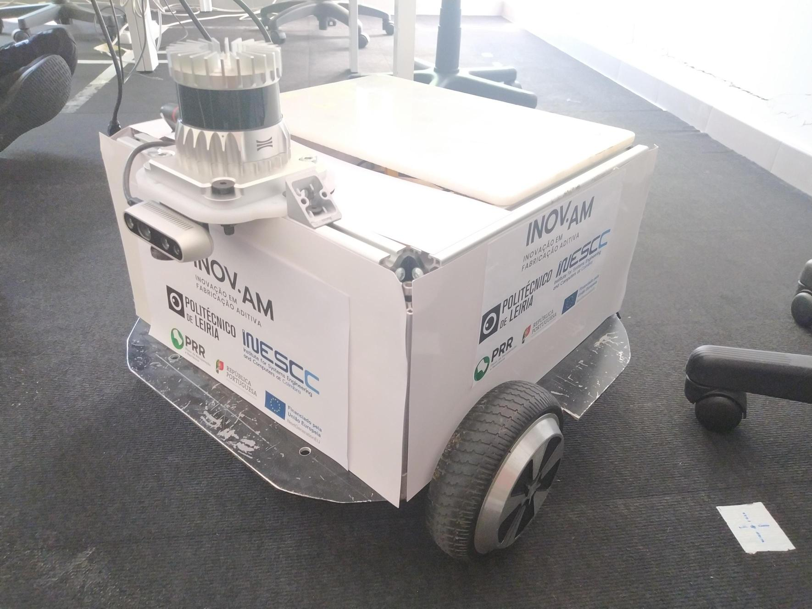

# 3DMoBot ROS2 Workspace

### Summary

 This repository contains the set of ROS2 packages required for the 3DMoBot project.  Workflow tested on Xubuntu 22.04 with ROS2 Humble.



### Quick Start
- Clone the repo:
    
    ```
    mkdir src; cd src
    git clone git@github.com:Ab-Tx/3DMoBot-ros2-packages.git
    cd 3DMoBot-ros2-packages
    git submodule init
    git submodule update --recursive
    ```

- Replace RTAB-Map, Odrive, and Realsense launch and configuration files with the custom ones:

    ```
    cp -r replace_rtabmap_ros/* rtabmap_ros
    cp -r replace_ros_odrive/* ros_odrive
    cp -r rs_launch.py realsense-ros/realsense2_camera/launch
    rm -r replace_rtabmap_ros
    rm -r replace_ros_odrive
    ```
- build the workspace
    ```
    # cd to the root of your workspace first!
    export MAKEFLAGS=-j6 # Can be ignored if you have a lot of RAM (>16GB)
    colcon build --symlink-install --cmake-args -DCMAKE_BUILD_TYPE=Release
    source ./install/local_setup.bash 
    ```
- Use the [cycloneDDS](https://docs.ros.org/en/humble/Installation/RMW-Implementations/DDS-Implementations/Working-with-Eclipse-CycloneDDS.html) (recommendationf rom RTAB-Map):
    ```
    export RMW_IMPLEMENTATION=rmw_cyclonedds_cpp
    ```
    - You can set it as default by adding it to bashrc: 
        ```
        echo "export RMW_IMPLEMENTATION=rmw_cyclonedds_cpp" >> ~/.bashrc
        ```

### Setup the CAN bus

Setup the CAN bus using:
```
sudo ip link set dev can0 type can bitrate 250000
sudo ip link set dev can0 txqueuelen 256
sudo ip link set dev can0 up
```
The interface "can0" should appear if you run `ip link show`.

Refer to Odrive S1 documentation for further details.

### Troubleshooting

If building fails, RTAB-Map and realsense-ros packages may require syncing with the latest version. The latest source of ROS2 Humble may introduce incompatibilities with the fetched versions. 

Also ensure:
- Data from sensors is being published.
- CAN bus is available.

### Content overview

- apriltag_ros (fork)
- my_nav2_launch 
- nav2focbox 
- opennav_docking 
- pointcloud_to_laserscan (fork)
- realsense-ros
    - ROS package for the realsense camera.
- robot_launch
    -   Launch file used to initiate near all** software used by the 3DMoBot.
- ros_odrive (fork)
    -   Odrive S1 ROS package.
- rtabmap
- rtabmap_ros
- replace_rtabmap_ros
    - Not a package. Contains several customized launch files for RTAB-Map.

** Refer to the commented information in robot.launch.py
